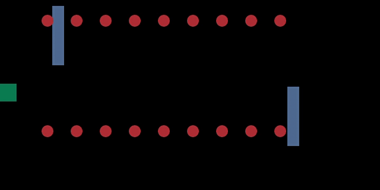

# The World's Hardest Game 
## Description
This program has been prepared using the Deep Q Learning model. The purpose of the application is that the "agent" eats all the baits with the best reward.




## Usage

| Function name | Description                    |
| ------------- | ------------------------------ |
| `train()`      | Train the agent according to the given parameters.|
| `test()`   | run the last trained model.|


- [ ] If you want train the model:
    - [ ] Open shell and go file directions.
    - [ ] Run this code
    
```bash
python dqn.py train
```

- [ ] If you want test the model:
    - [ ] Open shell and go file directions.
    - [ ] Run this code
    
```bash
python dqn.py test 
```


## Requirements

numpy==1.15.4

opencv-python==3.4.4.19

pygame==1.9.4

torch==1.0.0


## Authors & Licances

These files are protected under BTK AKADEMİ license. 
